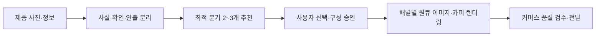

---

## 이 프로젝트는 무엇인가

김머신 이커머스 상세페이지 스튜디오는 범용 이미지 생성기가 아닙니다. 제품 사진과 검증된 정보를 받아 판매에 필요한 이미지 자산을 설계하고 만드는 **이커머스 전용 제작 스킬**입니다.

사용자가 결과물 종류를 아직 정하지 못했다면 제품·채널·보유 자료를 진단해 가장 적합한 제작 분기 2~3개를 먼저 제안합니다. 사용자가 하나를 고르면 제품 정체성과 사실 정보를 잠근 뒤, 호스트의 이미지 생성 기능을 이용해 선택한 결과물을 제작하고 검수합니다.

## 어떤 가치를 제공하나

| 흔한 제작 문제 | 이 스튜디오가 바꾸는 방식 |
| --- | --- |
| 어떤 이미지부터 만들어야 할지 모른다 | 제품 상황에 맞는 분기 2~3개와 전체 패키지를 이유와 함께 제안합니다. |
| 컷마다 제품 모양과 브랜드가 달라진다 | 마스터 제품 컷과 하나의 시각 시스템을 먼저 고정합니다. |
| 이미지 생성 중 과장 문구가 끼어든다 | 사실·확인 필요·연출 선택을 분리하고 근거 없는 효능·수치·인증을 차단합니다. |
| 중국어 상세페이지를 그대로 덮어써 외계 문자가 남는다 | 원문에서 제품·기능 구조만 추출하고, 이미지 생성 단계에서 중국어 제거와 한국어 렌더링을 함께 수행합니다. |
| 결과물은 많지만 실제 판매 페이지에 쓰기 어렵다 | 용도·수량·비율·품질 게이트가 정해진 커머스 산출물 세트로 전달합니다. |

## 만들 수 있는 것

| 분기 | 기본 산출물 | 적합한 상황 |
| --- | --- | --- |
| 메인·서브 썸네일 | 메인 1장 + 서브 5~7장 | 검색 목록에서 제품 식별과 클릭을 먼저 확보할 때 |
| 누끼컷 | 투명 PNG 1~4장 | 썸네일·합성·상세페이지의 마스터 제품 자산이 필요할 때 |
| 연출·실사용컷 | 4~10장 | 고객이 사용 장면과 라이프스타일을 상상해야 할 때 |
| 효용·기능 시각화컷 | 3~6장 | 열·냉기·흡수·구조 등 보이지 않는 장점을 이해시킬 때 |
| 상세페이지 이미지 | 6·8·10장, 기본 1080 × 2160px | 한국어 카피와 구매 설득 흐름을 세로 패널로 완성할 때 |
| 전체 이미지 패키지 | 라이트 또는 풀 세트 | 신규 출시·리뉴얼용 판매 이미지 전체가 필요할 때 |

상세페이지는 패널당 세로 2000px 이상을 기본으로 하며, 마지막 패널에는 제공된 사실만으로 구성한 FAQ를 둡니다.

## 어떻게 작동하나



1. 사용자의 시작 상태를 `탐색`, `분기 지정`, `수정`, `외국어 원본 현지화`로 판별합니다.
2. 이미 받은 내용은 다시 묻지 않고 실제로 부족한 제품 자료만 요청합니다.
3. 탐색 요청에는 적합한 분기만 압축해 제안합니다.
4. 상세페이지와 전체 패키지는 패널 구성안을 한 번 승인받습니다.
5. 제품 참조 이미지를 우선 사용하고, 각 자산의 제품·장면·효과·카피를 한 번의 이미지 생성 호출에서 완성합니다.
6. 제품 형상, 로고, 손·사용 장면, 한국어 오탈자, 규격과 미검증 주장을 확인합니다.

## 바로 시작하기

플러그인을 설치한 ChatGPT Work 대화에서는 다음처럼 요청할 수 있습니다.

```text
@machinebot-ecommerce-studio 이 텀블러를 판매하려고 해.
현재 사진을 보고 어떤 커머스 이미지를 먼저 만들면 좋을지 추천해 줘.
```

원하는 결과물이 분명하면 추천 단계를 건너뛰고 바로 지정할 수 있습니다.

```text
@machinebot-ecommerce-studio 이 제품 사진과 검증된 스펙으로
8장짜리 한국형 상세페이지를 만들어 줘. 마지막 장은 FAQ로 구성해 줘.
```

Codex에서는 스킬을 명시적으로 호출할 수 있습니다.

```text
$machinebot-ecommerce-studio 이 제품의 누끼, 썸네일, 연출컷,
효용 시각화컷, 상세페이지를 전체 패키지로 진행해 줘.
```

좋은 결과를 위해 제품 정면·측면·패키지 사진, 로고, 검증된 스펙, 핵심 고객, 판매 채널, 반드시 넣을 정확한 문구를 함께 제공하는 것이 좋습니다. 자료가 빠져 있어도 스킬이 필요한 항목만 골라 요청합니다.

> **현재 배포 상태**
>
> [`dist/machinebot-ecommerce-studio-1.8.0.zip`](./dist/machinebot-ecommerce-studio-1.8.0.zip)은 소스 검수와 로컬 설치 테스트, 영상 공유를 위한 배포본입니다. ChatGPT Work의 공개 플러그인 목록에 노출하려면 별도의 universal plugin directory 제출과 승인이 필요합니다.

## 설계 원칙

- **제품이 기준입니다.** 사용자 제품 사진, 로고, 패키지 문구와 사실 정보를 원본으로 취급합니다.
- **주장을 발명하지 않습니다.** 효능, 인증, 수치, 원산지, 순위, 리뷰와 비교 우위를 추측하지 않습니다.
- **생성보다 정체성을 우선합니다.** 제품이 중요한 작업은 새로 상상하기보다 참조 편집을 우선합니다.
- **외국어 원본은 이미지 생성으로 현지화합니다.** 중국어 상세페이지를 배경처럼 재사용하거나 한국어로 덮지 않고, 제품·기능 구조만 참조해 원문 제거와 한국어 카피를 생성 단계에서 함께 처리합니다.
- **카피를 별도 합성하지 않습니다.** 모든 언어에서 제품·배경·효과·타이포그래피를 패널별 한 번의 이미지 생성 호출로 완성하며, 투명 글자 PNG나 HTML·SVG·캔버스·시스템 폰트 레이어를 사용하지 않습니다.
- **커머스 밖으로 확장하지 않습니다.** 포스터, 캐릭터, 게임, UI, 순수 일러스트는 이 스킬의 범위가 아닙니다.
- **보지 않은 결과를 검수했다고 말하지 않습니다.** 실제 이미지를 열어 확인할 수 없으면 그 제한을 명시합니다.

## 프로젝트 구조

```text
.
├─ AGENTS.md                         # 처음 온 에이전트의 작업 규칙
├─ README.md                         # 프로젝트 소개와 시작점
├─ CHANGELOG.md                      # 문서·배포 변경 기록
├─ YOUTUBE_RELEASE_GUIDE.md          # 영상 공유와 데모 안내
├─ plugins/
│  └─ machinebot-ecommerce-studio/
│     ├─ .codex-plugin/plugin.json   # 플러그인 메타데이터
│     ├─ README.md                   # 압축 배포본 안의 독립 사용 안내
│     ├─ assets/                     # 김머신 원본·타이틀·YouTube 브랜드 이미지
│     └─ skills/machinebot-ecommerce-studio/
│        ├─ SKILL.md                 # 실행 오케스트레이션과 불변 규칙
│        ├─ agents/openai.yaml       # 스킬 표시·호출 메타데이터
│        └─ references/              # 분기·상세 설계·제작·검수 규칙
├─ validation/                       # 설계 근거와 행동 평가
└─ dist/                             # 버전별 배포 ZIP
```

## 에이전트와 기여자를 위한 안내

이 저장소를 처음 연 에이전트는 [`AGENTS.md`](./AGENTS.md)를 먼저 읽습니다. 실행 규칙의 단일 기준은 [`SKILL.md`](./plugins/machinebot-ecommerce-studio/skills/machinebot-ecommerce-studio/SKILL.md)이며, 작업 종류에 따라 아래 문서를 조건부로 읽습니다.

- 제작 분기와 수량: [`branches.md`](./plugins/machinebot-ecommerce-studio/skills/machinebot-ecommerce-studio/references/branches.md)
- 6·8·10장 상세 구성: [`detail-page-blueprint.md`](./plugins/machinebot-ecommerce-studio/skills/machinebot-ecommerce-studio/references/detail-page-blueprint.md)
- 참조 이미지와 생성 절차: [`image-production.md`](./plugins/machinebot-ecommerce-studio/skills/machinebot-ecommerce-studio/references/image-production.md)
- 외국어 상세페이지 현지화: [`source-detail-localization.md`](./plugins/machinebot-ecommerce-studio/skills/machinebot-ecommerce-studio/references/source-detail-localization.md)
- 최종 검수: [`quality-gates.md`](./plugins/machinebot-ecommerce-studio/skills/machinebot-ecommerce-studio/references/quality-gates.md)
- 설계 근거와 범위 결정: [`validation/design-notes.md`](./validation/design-notes.md)
- 대표 행동 시나리오: [`validation/behavior-evaluation.md`](./validation/behavior-evaluation.md)

핵심 동작을 바꿀 때는 문서만 고치지 말고 스킬, 관련 참조, 행동 평가, 플러그인 버전과 배포 ZIP까지 함께 갱신합니다.

## 범위와 한계

- 호스트에 이미지 생성·편집 기능이 없으면 실제 이미지를 만들 수 없으며, 이 경우 승인된 프롬프트와 제작 명세까지만 제공합니다.
- 실물 참조가 없으면 콘셉트 시안은 가능하지만 실제 제품과 동일하다고 보장할 수 없습니다.
- 최신 판매 채널 등록 규칙을 확인하지 않았다면 채널 규격 준수를 단정하지 않습니다.
- 의학·건강·인증·수치 주장은 사용자가 제공한 검증 근거 안에서만 다룹니다.

---

**상품 하나. 판매에 필요한 이미지 흐름 전체.**
